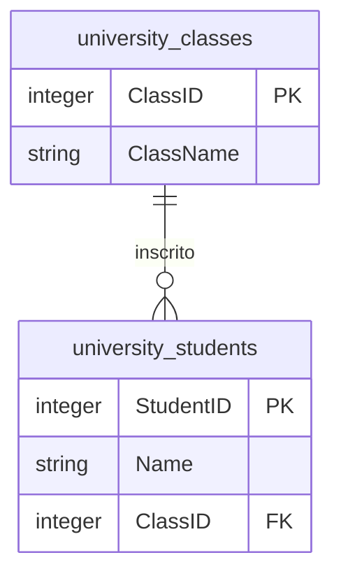

# Catálogo de Datasets

Este repositorio contiene una colección de datasets para prácticas de SQL y análisis de datos. A continuación se detalla cada dataset con su estructura, campos y relaciones.

---

## Índice

1. [Batman Movies](#1-batman-movies)
2. [Company](#2-company)
3. [Dealership](#3-dealership)
4. [Dummy](#4-dummy)
5. [Fortune 500](#5-fortune-500)
6. [IMDB](#6-imdb)
7. [ISDI Stock Prices](#7-isdi-stock-prices)
8. [ISDI Students](#8-isdi-students)
9. [Spotify Tracks](#9-spotify-tracks)
10. [Star Wars](#10-star-wars)

---

## 1. Batman Movies

**Descripción**: Dataset con información de todas las películas de Batman, incluyendo actores, directores, recaudación y salarios.

**Tabla**: `batman_movies`

| Campo | Tipo | Descripción |
|-------|------|-------------|
| Title | STRING | Título de la película |
| BatmanActor | STRING | Actor que interpreta a Batman |
| Director | STRING | Director de la película |
| ReleaseDate | DATE | Fecha de estreno |
| ReleaseYear | INTEGER | Año de estreno |
| BoxOfficeMillions | FLOAT | Recaudación en taquilla (millones USD) |
| BatmanSalaryMillions | FLOAT | Salario del actor de Batman (millones USD) |
| RuntimeMinutes | INTEGER | Duración en minutos |

---

## 2. Company

**Descripción**: Dataset empresarial completo de una empresa ficticia con 150 empleados (personajes de series famosas). Incluye gestión de RRHH, estructura organizacional, historial de salarios, cambios de puesto y catálogo de servicios internos.

### Tablas y Campos

#### 2.1. employees (Empleados)

| Campo | Tipo | Descripción |
|-------|------|-------------|
| employee_id | STRING | ID único del empleado (E0001, E0002...) |
| first_name | STRING | Nombre |
| last_name | STRING | Apellido |
| email | STRING | Email corporativo |
| phone | STRING | Teléfono |
| hire_date | DATE | Fecha de contratación |
| date_of_birth | DATE | Fecha de nacimiento |
| gender | STRING | Género (M/F) |
| is_active | STRING | Estado activo (Yes/No) |

#### 2.2. departments (Departamentos)

| Campo | Tipo | Descripción |
|-------|------|-------------|
| department_id | STRING | ID único (D001, D002...) |
| department_name | STRING | Nombre del departamento |

**Departamentos disponibles**:
- D001: Dirección General
- D002: Tecnología
- D003: Recursos Humanos
- D004: Marketing
- D005: Ventas
- D006: Finanzas
- D007: Operaciones
- D008: Atención al Cliente

#### 2.3. current_salaries (Salarios Actuales)

| Campo | Tipo | Descripción |
|-------|------|-------------|
| employee_id | STRING | FK a employees |
| department_id | STRING | FK a departments |
| role | STRING | Rol actual del empleado |
| current_salary | FLOAT | Salario actual en euros |
| last_update | DATE | Fecha de última actualización |

**Roles disponibles**: Director, Gerente, Supervisor, Senior, Especialista, Analista, Asistente.

#### 2.4. job_history (Historial Laboral)

| Campo | Tipo | Descripción |
|-------|------|-------------|
| job_history_id | STRING | ID único (JH0001, JH0002...) |
| employee_id | STRING | FK a employees |
| department_id | STRING | FK a departments |
| role | STRING | Rol en ese periodo |
| start_date | DATE | Fecha de inicio |
| end_date | DATE | Fecha de fin (NULL si es actual) |

#### 2.5. salary_history (Historial de Salarios)

| Campo | Tipo | Descripción |
|-------|------|-------------|
| salary_id | STRING | ID único (S0001, S0002...) |
| employee_id | STRING | FK a employees |
| job_history_id | STRING | FK a job_history |
| salary_amount | FLOAT | Monto del salario en euros |
| effective_date | DATE | Fecha efectiva del cambio |

#### 2.6. service_catalog (Catálogo de Servicios)

| Campo | Tipo | Descripción |
|-------|------|-------------|
| service_code | STRING | Código único (S001, S002...) |
| service_name | STRING | Nombre del servicio |
| category | STRING | Categoría (Training, Health, Software, Coaching) |
| unit_price | FLOAT | Precio unitario en euros |
| active_from | DATE | Fecha de inicio de vigencia |
| active_to | DATE | Fecha de fin (NULL si activo) |

#### 2.7. service_records (Registro de Servicios)

| Campo | Tipo | Descripción |
|-------|------|-------------|
| record_id | STRING | ID único del registro |
| employee_id | STRING | FK a employees |
| service_code | STRING | FK a service_catalog |
| service_date | DATE | Fecha del servicio |
| quantity | INTEGER | Cantidad de unidades |
| total_amount | FLOAT | Monto total (quantity × unit_price) |

### Relaciones entre Tablas

```mermaid
erDiagram
    employees ||--o{ current_salaries : "tiene"
    employees ||--o{ job_history : "tiene"
    employees ||--o{ salary_history : "tiene"
    employees ||--o{ service_records : "solicita"
    departments ||--o{ current_salaries : "pertenece"
    departments ||--o{ job_history : "pertenece"
    job_history ||--o{ salary_history : "asociado"
    service_catalog ||--o{ service_records : "utiliza"

    employees {
        string employee_id PK
        string first_name
        string last_name
        string email
        string phone
        date hire_date
        date date_of_birth
        string gender
        string is_active
    }

    departments {
        string department_id PK
        string department_name
    }

    current_salaries {
        string employee_id FK
        string department_id FK
        string role
        float current_salary
        date last_update
    }

    job_history {
        string job_history_id PK
        string employee_id FK
        string department_id FK
        string role
        date start_date
        date end_date
    }

    salary_history {
        string salary_id PK
        string employee_id FK
        string job_history_id FK
        float salary_amount
        date effective_date
    }

    service_catalog {
        string service_code PK
        string service_name
        string category
        float unit_price
        date active_from
        date active_to
    }

    service_records {
        string record_id PK
        string employee_id FK
        string service_code FK
        date service_date
        integer quantity
        float total_amount
    }

\`\`\`

---

## 3. Dealership

**Descripción**: Inventario de un concesionario de coches con información de vehículos en stock.

**Tabla**: \`car_inventory\`

| Campo | Tipo | Descripción |
|-------|------|-------------|
| VehicleId | STRING | ID único del vehículo (matrícula) |
| Brand | STRING | Marca del vehículo |
| CarModel | STRING | Modelo del vehículo |
| Year | INTEGER | Año de fabricación |
| Color | STRING | Color |
| Transmission | STRING | Tipo de transmisión (Manual/Automática) |
| FuelType | STRING | Tipo de combustible (Gasolina/Híbrido/Diésel) |
| Mileage | FLOAT | Kilometraje |
| Price | FLOAT | Precio en euros |
| DateAdded | DATE | Fecha de ingreso al inventario |

---

## 4. Dummy

**Descripción**: Colección de datasets de ejemplo para prácticas de SQL básico (JOINs, UNION, subqueries).

### 4.1. Supermarket (3 tablas)

#### supermarket_customers

| Campo | Tipo | Descripción |
|-------|------|-------------|
| CustomerID | INTEGER | ID único del cliente |
| Name | STRING | Nombre del cliente |

#### supermarket_orders

| Campo | Tipo | Descripción |
|-------|------|-------------|
| OrderID | INTEGER | ID único del pedido |
| CustomerID | INTEGER | FK a customers |
| Product | STRING | Producto pedido |
| OrderDate | DATE | Fecha del pedido |

#### supermarket_product_prices

| Campo | Tipo | Descripción |
|-------|------|-------------|
| ProductID | STRING | Nombre del producto |
| EffectiveDate | DATE | Fecha de vigencia del precio |
| Price | FLOAT | Precio en euros |

```mermaid
erDiagram
    supermarket_customers ||--o{ supermarket_orders : "realiza"
    supermarket_orders }o--|| supermarket_product_prices : "precio"
    
    supermarket_customers {
        integer CustomerID PK
        string Name
    }
    
    supermarket_orders {
        integer OrderID PK
        integer CustomerID FK
        string Product
        date OrderDate
    }
    
    supermarket_product_prices {
        string ProductID PK
        date EffectiveDate PK
        float Price
    }
```

### 4.2. University (2 tablas)

#### university_students

| Campo | Tipo | Descripción |
|-------|------|-------------|
| StudentID | INTEGER | ID único del estudiante |
| Name | STRING | Nombre del estudiante |
| ClassID | INTEGER | FK a classes (puede ser NULL) |

#### university_classes

| Campo | Tipo | Descripción |
|-------|------|-------------|
| ClassID | INTEGER | ID único de la clase |
| ClassName | STRING | Nombre de la clase |



### 4.3. HR Departments (3 tablas)

Tres tablas con la misma estructura para practicar operaciones UNION:

- \`hhrr_dept_a_employees\`
- \`hhrr_dept_b_employees\`
- \`hhrr_dept_c_employees\`

| Campo | Tipo | Descripción |
|-------|------|-------------|
| EmployeeID | INTEGER | ID del empleado |
| Name | STRING | Nombre del empleado |
| Email | STRING | Email corporativo |

**Nota**: Los empleados pueden estar duplicados entre departamentos.

---

## 5. Fortune 500

**Descripción**: Listado de las 500 empresas más grandes de Estados Unidos con información financiera.

**Tabla**: \`fortune\`

| Campo | Tipo | Descripción |
|-------|------|-------------|
| Rank | INTEGER | Posición en el ranking |
| Company | STRING | Nombre de la empresa |
| Sector | STRING | Sector de la empresa |
| Industry | STRING | Industria específica |
| Location | STRING | Ubicación (ciudad, estado) |
| Revenue | INTEGER | Ingresos (millones USD) |
| Profits | INTEGER | Beneficios (millones USD) |
| Employees | INTEGER | Número de empleados |

---

## 6. IMDB

**Descripción**: Top 5000 títulos de IMDB con las mejores puntuaciones.

**Tabla**: \`imdb_titles\`

| Campo | Tipo | Descripción |
|-------|------|-------------|
| primaryTitle | STRING | Título de la película/serie |
| titleType | STRING | Tipo (movie, tvSeries, etc.) |
| startYear | INTEGER | Año de estreno |
| endYear | INTEGER | Año de finalización (series) |
| runtimeMinutes | INTEGER | Duración en minutos |
| genre | STRING | Géneros (separados por coma) |
| director | STRING | Director(es) |
| averageRating | FLOAT | Puntuación media (0-10) |
| numVotes | INTEGER | Número de votos |

---

## 7. ISDI Stock Prices

**Descripción**: Precios históricos simulados de acciones de ISDI desde 2015.

**Tabla**: \`isdi_stock_prices\`

| Campo | Tipo | Descripción |
|-------|------|-------------|
| Fecha | DATE | Fecha de la sesión |
| Apertura | FLOAT | Precio de apertura |
| Cierre | FLOAT | Precio de cierre |
| Maximo | FLOAT | Precio máximo del día |
| Minimo | FLOAT | Precio mínimo del día |
| Volumen | INTEGER | Volumen de transacciones |

---

## 8. ISDI Students

**Descripción**: Base de datos de estudiantes de ISDI con información personal y académica.

**Tabla**: \`isdi_students\`

| Campo | Tipo | Descripción |
|-------|------|-------------|
| IdEstudiante | INTEGER | ID único del estudiante |
| Nombre | STRING | Nombre |
| Apellido1 | STRING | Primer apellido |
| Apellido2 | STRING | Segundo apellido |
| FechaNacimiento | DATE | Fecha de nacimiento |
| Edad | INTEGER | Edad actual |
| Programa | STRING | Programa cursado |
| SiglasPrograma | STRING | Siglas del programa (DMBA, MDA, etc.) |
| Email | STRING | Email educativo |
| FechaMatriculacion | DATE | Fecha de matrícula |

---

## 9. Spotify Tracks

**Descripción**: Dataset de canciones populares de Spotify con dos vistas diferentes.

### Tablas y Campos

#### 9.1. spotify_tracks

Dataset general con ~5300 canciones por género.

| Campo | Tipo | Descripción |
|-------|------|-------------|
| Genre | STRING | Género musical |
| ArtistName | STRING | Nombre del artista |
| TrackName | STRING | Título de la canción |
| Popularity | INTEGER | Popularidad (0-100) |
| Duration | INTEGER | Duración en segundos |

#### 9.2. top50_spotify

Top 50 canciones por países específicos.

| Campo | Tipo | Descripción |
|-------|------|-------------|
| Countries | STRING | Países donde fue top (códigos separados por coma) |
| TrackName | STRING | Título de la canción |
| ArtistName | STRING | Nombre del artista |
| AlbumName | STRING | Nombre del álbum |
| Popularity | INTEGER | Popularidad (0-100) |
| Date | DATE | Fecha del ranking |
| Duration | STRING | Duración (formato MM:SS) |

---

## 10. Star Wars

**Descripción**: Personajes del universo Star Wars con características físicas y origen.

**Tabla**: \`star_wars_characters\`

| Campo | Tipo | Descripción |
|-------|------|-------------|
| name | STRING | Nombre del personaje |
| height | INTEGER | Altura en centímetros |
| mass | INTEGER | Masa en kilogramos |
| hair_color | STRING | Color de cabello |
| skin_color | STRING | Color de piel |
| eye_color | STRING | Color de ojos |
| birth_year | STRING | Año de nacimiento (BBY/ABY) |
| gender | STRING | Género |
| homeworld | STRING | Planeta de origen |
| species | STRING | Especie |

---

## Notas Generales

- Los datasets están diseñados para prácticas educativas de SQL
- Algunos contienen datos sintéticos generados con scripts Python
- Los formatos numéricos pueden variar (punto vs coma decimal)
- Fechas generalmente en formato ISO (YYYY-MM-DD)
- Algunos campos pueden contener valores NULL para simular datos reales

## Licencias y Fuentes

- **Company**: Datos sintéticos generados
- **IMDB**: Datos públicos de IMDB
- **MovieLens**: GroupLens Research
- **Spotify**: Datos de la API pública de Spotify
- **Fortune 500**: Datos públicos de Fortune Magazine
- **RENFE**: Datos públicos de RENFE
- **Rolling Stone**: Lista publicada por Rolling Stone
- **Star Wars**: SWAPI (Star Wars API)
- Resto: Datasets sintéticos o de dominio público
